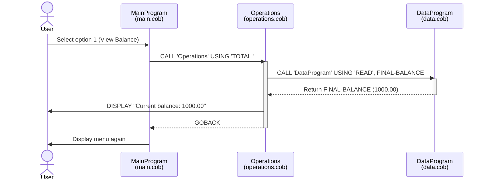
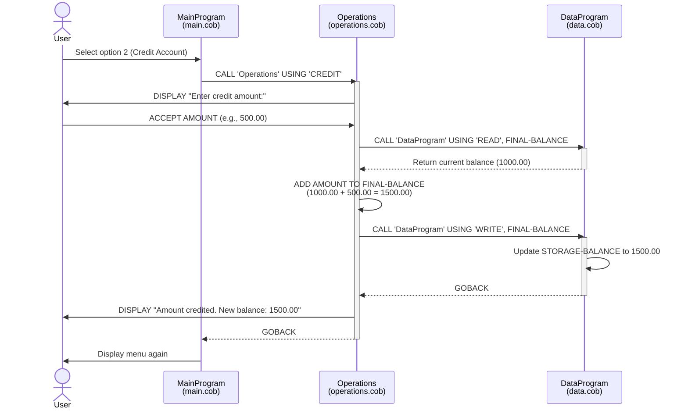
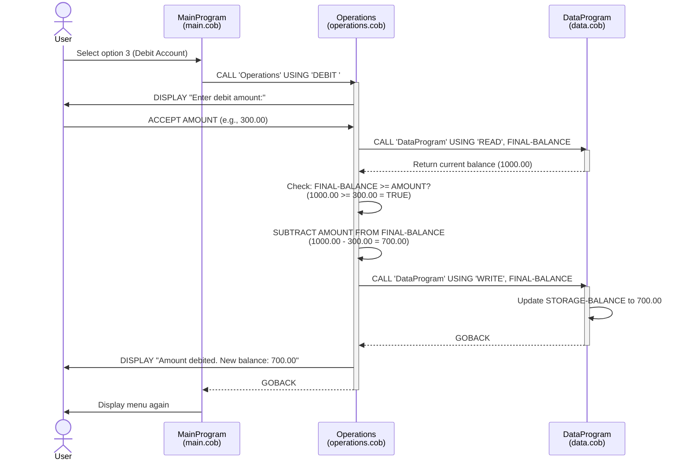
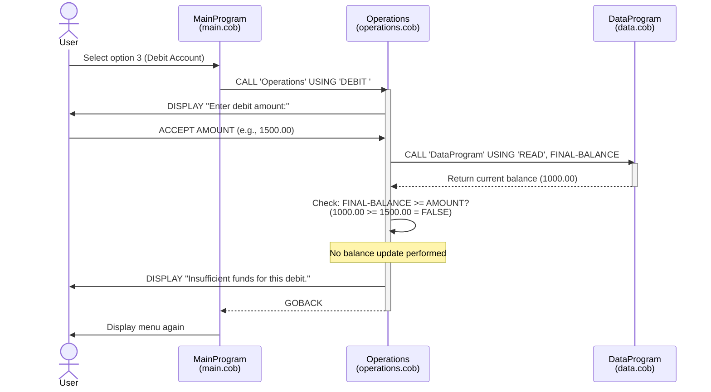
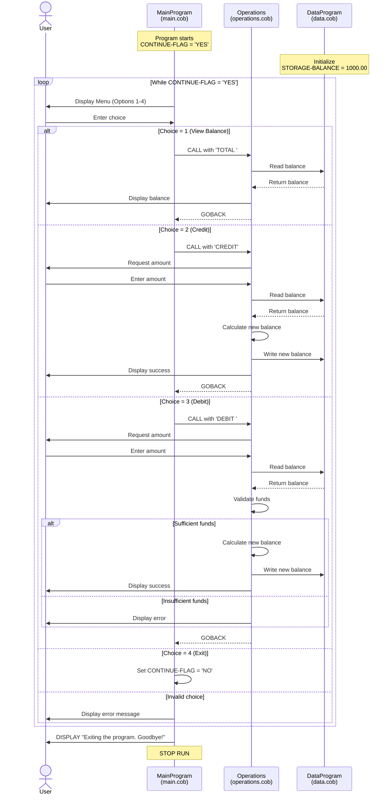

# COBOL Student Account Management System Documentation

## Overview

This legacy COBOL application implements a simple student account management system that allows users to view balances, credit accounts, and debit accounts. The system is built using a modular architecture with three separate COBOL programs that communicate through CALL statements.

## System Architecture

The application follows a three-tier architecture:
- **Presentation Layer**: `main.cob` - User interface and menu system
- **Business Logic Layer**: `operations.cob` - Account operations and business rules
- **Data Layer**: `data.cob` - Data storage and retrieval

## COBOL Files Documentation

### 1. main.cob - Main Program (Entry Point)

**Program ID**: `MainProgram`

**Purpose**: 
Serves as the application entry point and provides the user interface for the Account Management System. It displays a menu-driven interface and routes user choices to the appropriate operations.

**Key Functions**:
- **Menu Display**: Presents a user-friendly menu with four options:
  1. View Balance
  2. Credit Account
  3. Debit Account
  4. Exit
- **User Input Handling**: Accepts and validates user menu choices (1-4)
- **Operation Routing**: Calls the Operations program with appropriate parameters based on user selection
- **Program Flow Control**: Manages the main application loop until user chooses to exit

**Data Structures**:
- `USER-CHOICE` (PIC 9): Stores the user's menu selection
- `CONTINUE-FLAG` (PIC X(3)): Controls the main program loop (YES/NO)

**Business Rules**:
- Only accepts numeric choices between 1-4
- Displays error message for invalid input
- Continues running until user explicitly chooses to exit (option 4)

---

### 2. operations.cob - Operations Program (Business Logic)

**Program ID**: `Operations`

**Purpose**: 
Implements the core business logic for account operations. Acts as an intermediary between the main program and data storage, performing calculations and enforcing business rules for financial transactions.

**Key Functions**:

#### TOTAL Operation
- **Purpose**: Retrieves and displays the current account balance
- **Process**: 
  - Calls DataProgram with 'READ' operation
  - Displays the current balance to the user

#### CREDIT Operation
- **Purpose**: Adds funds to the student account
- **Process**:
  1. Prompts user to enter credit amount
  2. Reads current balance from DataProgram
  3. Adds credit amount to current balance
  4. Writes updated balance back to DataProgram
  5. Displays confirmation with new balance
- **Business Rules**: 
  - No validation on maximum credit amount
  - All credit amounts are immediately applied

#### DEBIT Operation
- **Purpose**: Withdraws funds from the student account
- **Process**:
  1. Prompts user to enter debit amount
  2. Reads current balance from DataProgram
  3. Validates sufficient funds are available
  4. If sufficient: subtracts amount and updates balance
  5. If insufficient: displays error message without updating balance
  6. Displays result (success with new balance or failure message)
- **Business Rules**: 
  - **Insufficient Funds Check**: Prevents overdrafts by verifying balance >= debit amount
  - Account balance cannot go negative
  - Failed debit attempts do not modify the account balance

**Data Structures**:
- `OPERATION-TYPE` (PIC X(6)): Stores the type of operation to perform
- `AMOUNT` (PIC 9(6)V99): Stores transaction amounts (max: 999,999.99)
- `FINAL-BALANCE` (PIC 9(6)V99): Working storage for balance calculations

**Parameters**:
- `PASSED-OPERATION` (PIC X(6)): Receives operation type from MainProgram

---

### 3. data.cob - Data Program (Data Layer)

**Program ID**: `DataProgram`

**Purpose**: 
Manages the persistent storage of the account balance. Provides a simple data access layer with read and write operations. Acts as the single source of truth for account balance.

**Key Functions**:

#### READ Operation
- **Purpose**: Retrieves the current stored balance
- **Process**: Copies the value from `STORAGE-BALANCE` to the output parameter

#### WRITE Operation
- **Purpose**: Updates the stored balance with a new value
- **Process**: Copies the input parameter value to `STORAGE-BALANCE`

**Data Structures**:
- `STORAGE-BALANCE` (PIC 9(6)V99): The persistent account balance (initialized to 1000.00)
- `OPERATION-TYPE` (PIC X(6)): Stores the requested operation type

**Parameters**:
- `PASSED-OPERATION` (PIC X(6)): Input - Specifies READ or WRITE operation
- `BALANCE` (PIC 9(6)V99): Input/Output - Balance value for read/write operations

**Initial State**:
- Default starting balance: **$1,000.00**

---

## Business Rules Summary

### Account Balance Rules
1. **Initial Balance**: All accounts start with $1,000.00
2. **Maximum Balance**: Cannot exceed $999,999.99 (limited by PIC 9(6)V99 data type)
3. **Minimum Balance**: Cannot go below $0.00 (enforced by insufficient funds check)
4. **Decimal Precision**: Two decimal places (cents)

### Transaction Rules
1. **Credit Transactions**:
   - No minimum or maximum amount restrictions
   - Immediately applied to account balance
   - No transaction validation beyond data type limits

2. **Debit Transactions**:
   - Must have sufficient funds (balance >= debit amount)
   - Cannot overdraft the account
   - Failed debits do not modify the account
   - Displays clear error message for insufficient funds

### System Rules
1. **Data Persistence**: Balance is maintained in memory during program execution
2. **Single Account**: System manages one account at a time
3. **Synchronous Processing**: All operations complete before returning to menu
4. **No Transaction History**: System does not maintain audit trail or transaction log

## Technical Specifications

### Data Type Specifications
- **Balance/Amount Fields**: PIC 9(6)V99
  - Maximum value: 999,999.99
  - Minimum value: 0.00
  - Decimal places: 2
  
### Program Communication
- Uses COBOL CALL statement for inter-program communication
- Parameters passed USING clause
- Programs return control using GOBACK statement

### Known Limitations
1. **No Persistence**: Balance resets to $1,000.00 when program restarts
2. **Single User**: No multi-user or concurrency support
3. **No Authentication**: No user login or account verification
4. **No Transaction Log**: No audit trail or history tracking
5. **Limited Error Handling**: Basic validation only for insufficient funds
6. **No Decimal Input Validation**: Could potentially accept malformed numeric input

## Future Enhancement Considerations
- Add file-based persistence for account balance
- Implement multiple account support with account IDs
- Add transaction history and audit logging
- Include user authentication and authorization
- Add input validation and error handling
- Implement transaction rollback capabilities
- Add reporting and analytics features

## Application Data Flow Sequence Diagrams

### View Balance Flow

### Credit Account Flow

### Debit Account Flow (Sufficient Funds)

### Debit Account Flow (Insufficient Funds)

### Complete Application Lifecycle

